# Gamblers Anonymous
Thomas Forget, Alex Edwards, Sarah Donofrio, Brad Kaley

## Project Overview & Goals

With the rise in popularity of cryptocurrency and online gambling, we set out to create a blackjack application in which a user can deposit Ethereum (ETH) in exchange for a new token to use to play blackjack. Once the user is finished playing the game, the user's token balance can be exchanged for the equivalent amount of ETH and withdrawn to their personal wallet. A

To achieve the overall goal of creating a blackjack application, we had to complete the following:

1. Create code for smart contracts in Solidity to allow the user to deposit/withdraw ETH in exchange for a new GamblerCoin (GBC) token;
2. Include functionality to continuously mint and burn tokens as necessary as the user interacts with the game;
3. Create code for a functional blackjack game in Python;
4. Create code to integrate the game (Python) and smart contracts (Solidity);
5. Deploy the smart contract using Remix IDE and the Injected Web3 Environment to connect with a local blockchain (Ganache) through MetaMask; and
6. Deploy the Streamlit application and use the connected local blockchain to test and improve its functionality.

In order to run and test the application, you need to have Ganache (https://trufflesuite.com/ganache/index.html) and MetaMask (https://metamask.io/) installed on your computer.

---
## Code Creation & Setup 
### Solidity Smart Contract 
Solidity was used to code the two smart contracts: DEX and GamblerCoin. The GamblerCoin contract defines the new GBC token and the functionality for minting and burning tokens. The GamblerCoin contract's functionality is inherited into the DEX contract by defining a token variable of the type GamblerCoin. The DEX contract provides the functionality for deploying the token with an initial supply of zero; conversions from between WEI, ETH, and GBC; and buying/selling tokens using ETH.

To launch the code, the below steps must be followed:
1. Launch the Remix IDE in your browser, create a new contract, and copy/paste in the code from the GamblerCoin.sol file. Alternatively, the Solidity file can be imported directly into Remix IDE.

    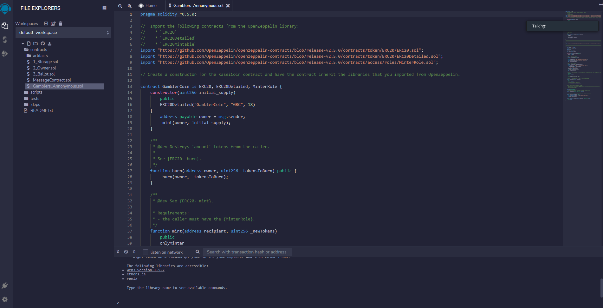

2. Compile the smart contracts in Remix IDE.

    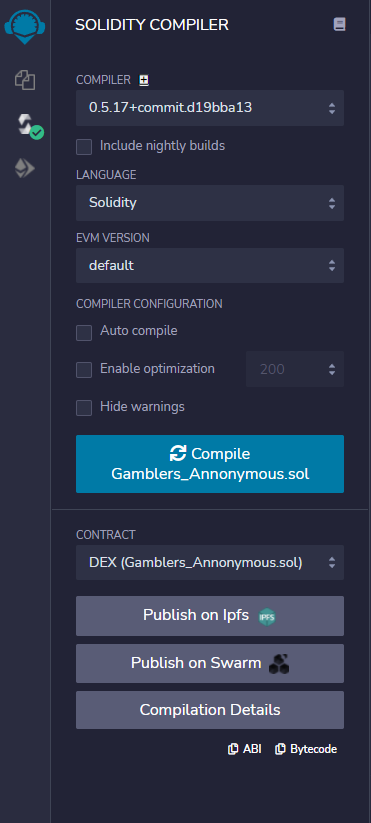

3. Open MetaMask and create a new test network to connect to the local blockchain. To do this, click on the network dropdown menu in MetaMask and click "Add Network." 

    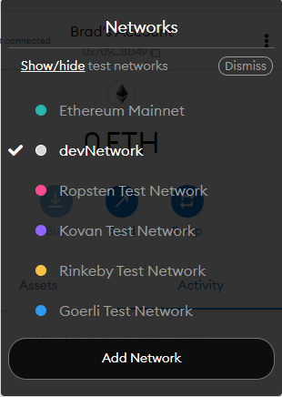

    This will bring you to a new page in your browser which asks for details of the new network. If you're using Ganache, use the inputs in the screenshot below and click "Save." This will create the network in your MetaMask and you must go to MetaMask in your browser and select this new developer network from the dropdown menu. For further help or background on creating a new network, refer to this help page: https://dev.to/afozbek/how-to-add-custom-network-to-metamask-l1n. Your 

    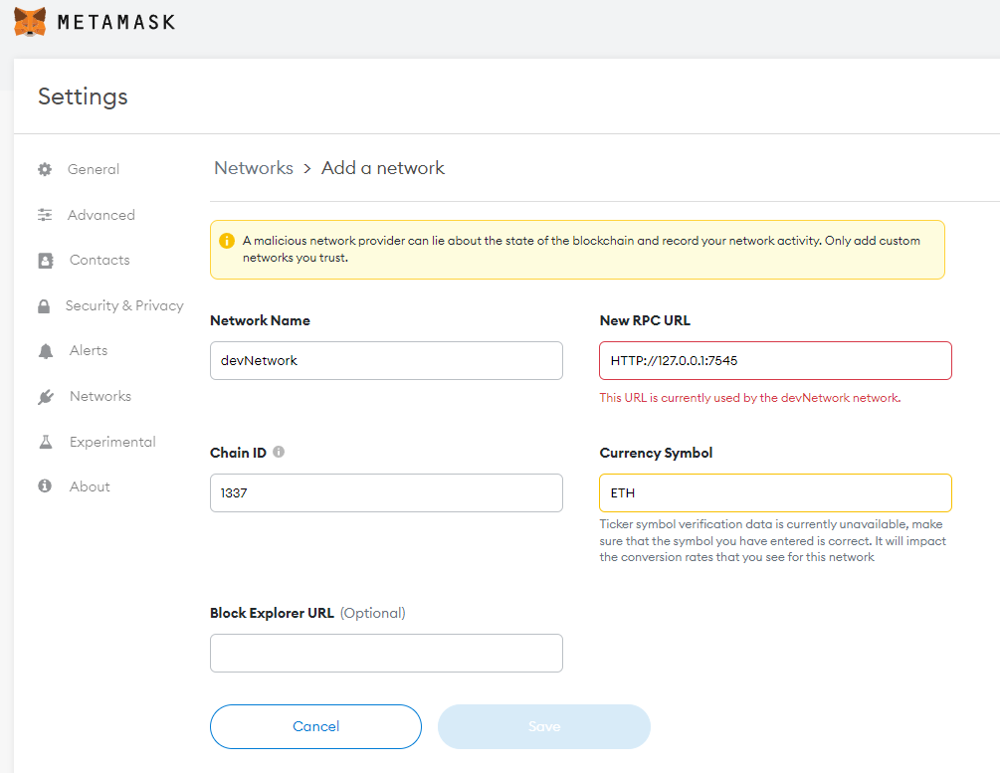

4. Start Ganache and connect it with MetaMask using the private keys from the individual Ganache accounts. The initial Ganache dashboard should show 100 ETH in each account, as shown below.

    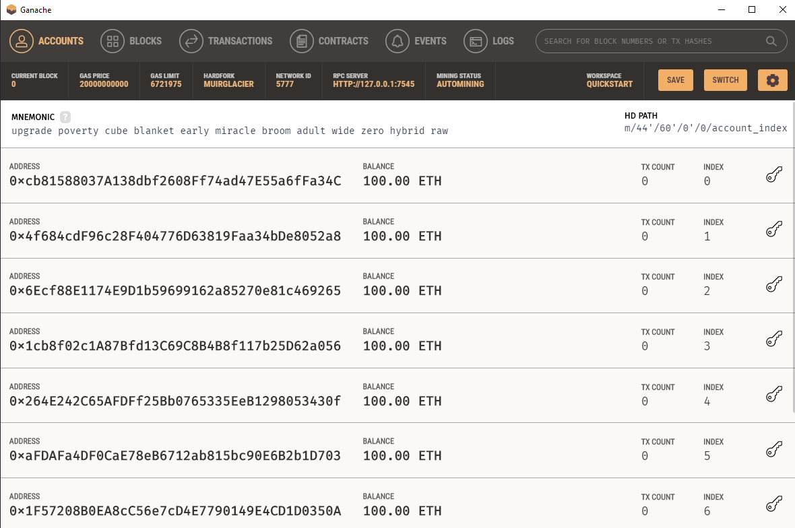

    Click on the "key" symbol on the right hand side for one of the accounts you want to connect to MetaMask and the smart contracts. Copy the private key for the account. 

    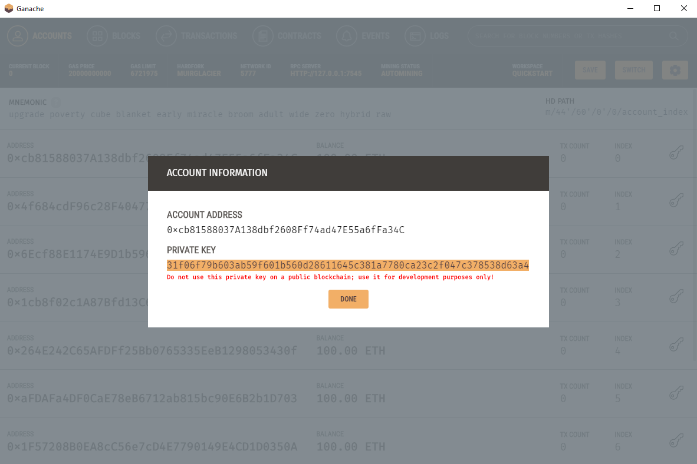

    In MetaMask, click on the circle logo at the top right hand side, and then click on "Import Account." The private key from the Ganache account can then be pasted here to create the account. Repeat this step for the number of accounts you want to connect to MetaMask. For the purposes of testing, only 1-2 accounts are likely needed.

    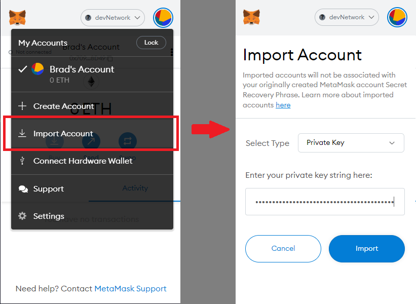

5. Now the smart contracts need to be deployed in Remix IDE using the Injected Web3 Environment which will connect to MetaMask. Click on the deployer tab on the left hand side of Remix IDE and select Injected Web3 from the Environment dropdown menu. When this is done, a message from MetaMask will automatically pop up and you must follow the prompts to select and connect the accounts you imported to MetaMask in Step 4.

    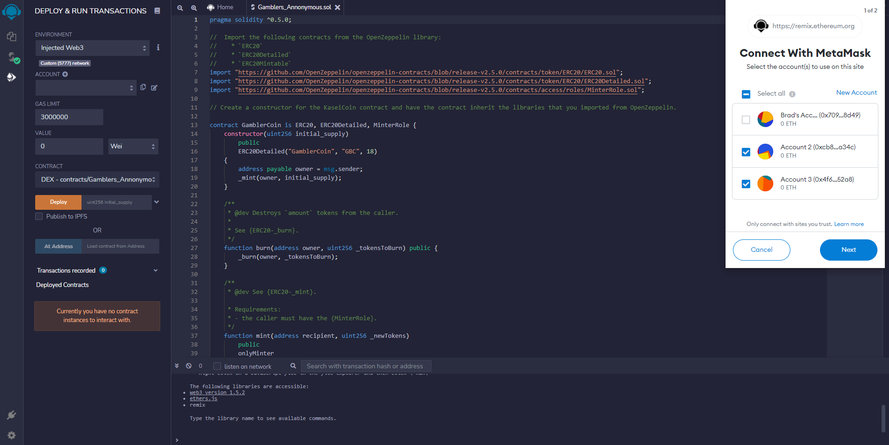

6. Once Metamask, Ganache, and Remix IDE are all successfully connected, select the account you want to deploy the contract with in MetaMask. In the deployer tab in Remix IDE, select the contract DEX, set the initial coin supply to zero, and click "Deploy." Once deployed, the contract can be expanded on the left hand side of Remix IDE and it will look like following:

    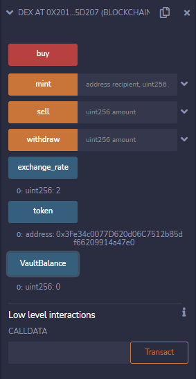

7. The token address listed inside the DEX contract (in the screenshot above, this is 0x3Fe34c0077D620d06C7512b85df66209914a47e0) should be copied and pasted into the "At Address" input box on the left hand side of Remix IDE to load the GamblerCoin contract. There is no need to deploy the GamblerCoin since it was already deployed when the DEX contract was deployed.

    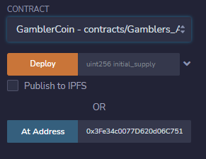

    Once deployed, the GamblerCoin contract can be expanded on the left hand side of Remix IDE and it will look like following:

    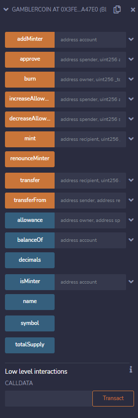

8. The final setup step for the smart contracts requires the smart contract address for the DEX and GamblerCoin contracts to be copied into a .env file. Create a new text or markdown file and set it up in the same manner as shown below. 

    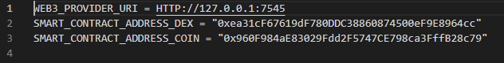

    The Web3_Provider_URI should be the same as is shown in the image above if you are using Ganache. For "SMART_CONTRACT_ADDRESS_DEX" and "SMART_CONTRACT_ADDRESS_COIN," copy the smart contract addresses from the deployed contracts on the left hand side of Remix IDE by clicking on the copy button at the top of each contract. Save the text file as a Plain Text file with the file name of just .env.

    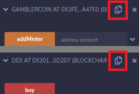

### Python Blackjack Game
The game was coded in Python using a base set of code from Michael Camden-Smith's GitHub repository (https://github.com/MikeyCam/blackjack_simulator). The code for this base game was updated and expanded upon with more functionality for in-game play (e.g., higher payouts for getting a blackjack) and connection with the user's token balance in-game from the smart contract. 

The rules and game play of Blackjack can be found here (https://bicyclecards.com/how-to-play/blackjack/).

### Deployed Application
With the smart contracts and game created, and the smart contracts deployed, the final step was to create the application code functionality in Python. This code utilized the Streamlit library. 

To deploy the application using Streamlit, navigate with GitBash to the folder where all the files for this application are saved. As shown below, enter the command "streamlit run app.py" to deploy the app, which will open in your browser.

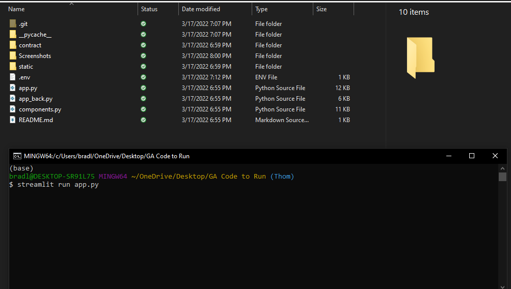

The running application's homepage will look like the screenshot below.

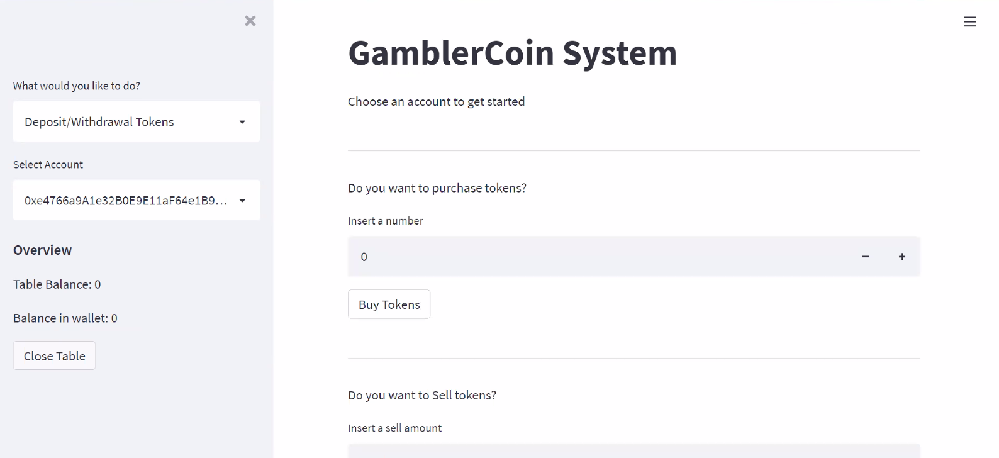

 

---
## Results 

The player must select the Play Game tab located in the left sidebar to start the game.

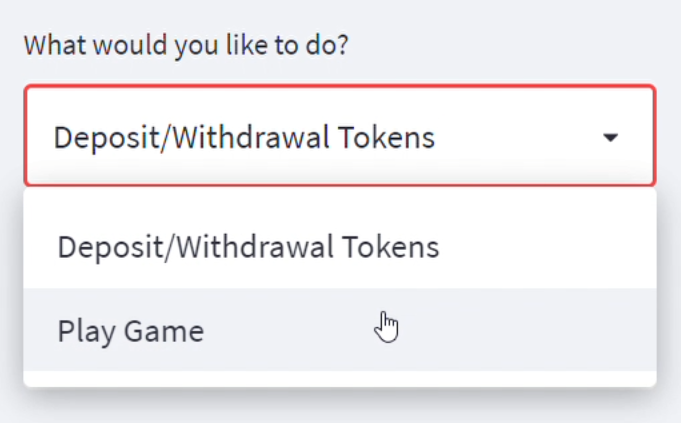

Once the Play Game tab is selected, the player will be taken to the Blackjack Simulator interface.

The left hand sidebar displays an overview of the player's tokens available at the table and in their wallet balance. 

To start the game, the player will be asked how many chips they would like to bet? The player must enter a value equal to or less than the total tokens at the table. 

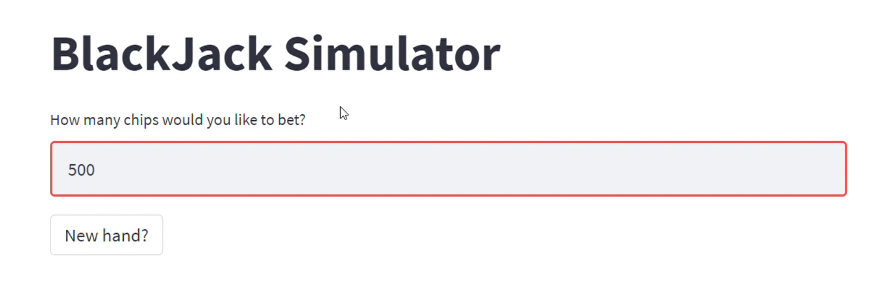

The player will then be dealt in the hand displaying both of the player's cards face up, and one of the dealer's cards face up the other down. 
The player will be given the option to Hit, Double, or Stand on the current hand.
Underneath the player's cards in green text displays both the player's hand and the best possible result of the current hand.

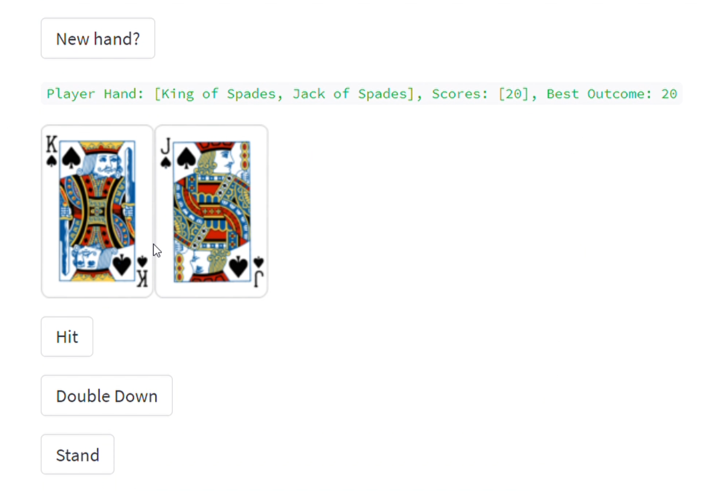

Once the player has made an action, the dealer will reveal their hidden card, adding a card to their until a sum value greater than 17.
Below the dealer's hand is the commentary of both the player's actions and the dealers, displaying the result of the hand played.
Once the hand is complete, you will see the table balance located at the bottom of the hand and in the sidebar updated to reflect the current balance.

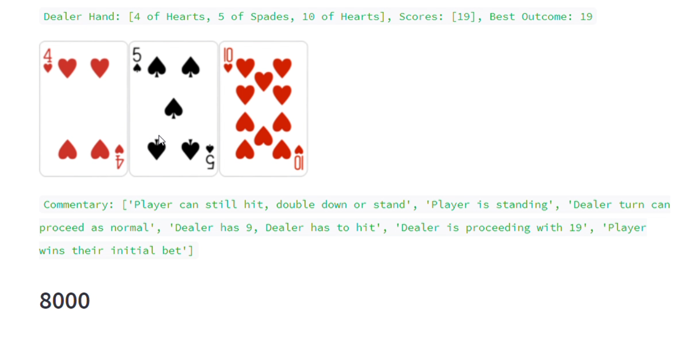

Once the hand is over to play again, the player must enter the bet amount they would like to wagger or leave it the same, then select the New Hand button.

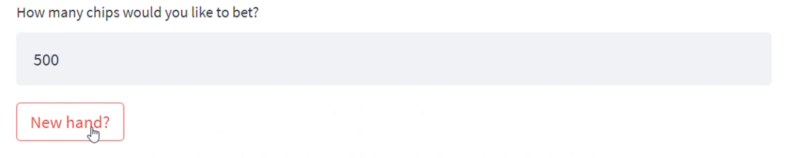

This gameplay process is then repeated until either the player decides to stop playing or runs out of tokens to bet. 
To reload chips, all the player has to do is scroll over to the sidebar and select the Deposit/Withdrawl Tokens page. 

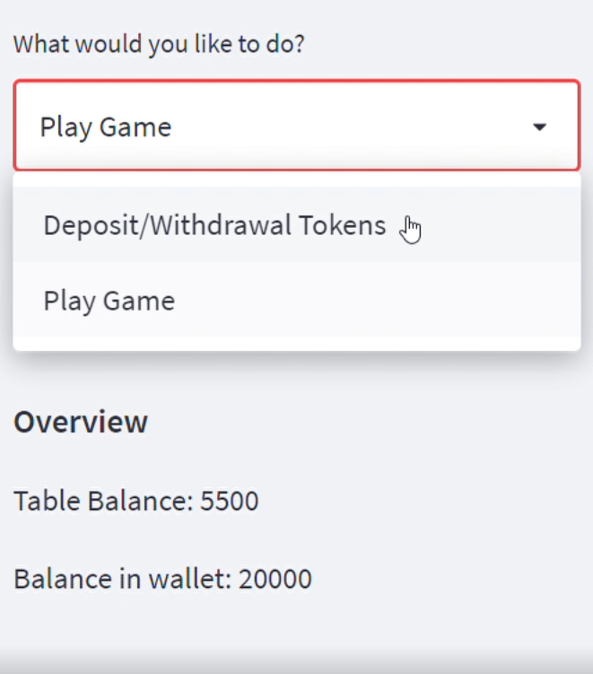
 

---
## Next Steps
The next steps to improve the game would be to work through additional bugs in the application, improve functionality of the game, and improve the user interface and user experience. This work would include, at a minimum, the following:

- Error messages that are initially displayed should be removed (although they don't affect the functionality)
- Create an oracle for the exchange rate
- Sign in the game with a username and password
- Allow multi-player functionality 
- Design code for a continuous deck of cards

Once the game is improved, it could be deployed and hosted online for people to actively use. However, research into the legal aspects of deploying and operating the game (e.g., gambling license, selling coins, etc.) would need to be done first.